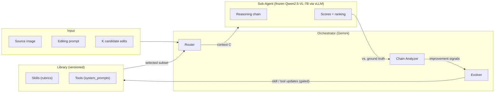

# RewardHarness

[](https://arxiv.org/abs/2605.08703)
[](https://huggingface.co/papers/2605.08703)
[](https://rewardharness.com)
[](https://github.com/TIGER-AI-Lab/RewardHarness/releases/latest)
[](LICENSE)
[](https://www.python.org/downloads/)

**Self-evolving agentic reward framework for image-editing evaluation.**

Code release for [*RewardHarness: Self-Evolving Agentic Post-Training*](https://arxiv.org/abs/2605.08703) (arXiv 2605.08703). Project page: [rewardharness.com](https://rewardharness.com).

## Contents

[What you can do](#what-you-can-do-with-this-code) &middot;
[Architecture](#architecture) &middot;
[Hardware](#hardware-requirements) &middot;
[Install](#install) &middot;
[Quickstart](#quickstart) &middot;
[Reproduce paper](#reproduce-paper-results) &middot;
[Config](#key-config-configsdefaultyaml) &middot;
[Swap Sub-Agent](#swapping-in-a-different-vlm-as-sub-agent) &middot;
[Walkthrough](#walkthrough) &middot;
[Output artifacts](#output-artifacts) &middot;
[Troubleshooting](#troubleshooting) &middot;
[Contributing](#contributing) &middot;
[Security](#security) &middot;
[Citation](#citation)

## What you can do with this code

- **Score image edits** &mdash; use the evolved Library + frozen Sub-Agent to produce a 1&ndash;4 preference judgment between two edited candidates of the same source image and instruction.
- **Reproduce paper numbers** &mdash; one command (`make reproduce`) runs the full pipeline (env setup → vLLM serve → 5-iter evolution → benchmark) and prints the K=2/3/4 + GenAI-Bench accuracies in `results/`.
- **Evolve your own library** &mdash; point `scripts/run_evolution.py` at any preference dataset of <a href="OUTPUTS.md#after-make-demo--make-evolve--scriptsrun_evolutionpy">the same shape</a> (~100 examples is enough) to grow a Skills + Tools library for *your* evaluation criteria. No reward-model training required.
- **Drop in as a GRPO reward signal** &mdash; the evolved Library outputs a scalar score that's directly compatible with the EditReward GRPO normalization (see paper §3.2).

Read [`WALKTHROUGH.md`](WALKTHROUGH.md) for the 9-step path from `git clone` to your first preference judgment.

## Updates

- **2026-05-16** — `v0.1.2` released (smallest-end-to-end `examples/score_pair.py`, CI scaffolding, packaging fixes). Code also mirrored at [`KlingAIResearch/RewardHarness`](https://github.com/KlingAIResearch/RewardHarness); both repos kept in sync.
- **2026-05-16** — `v0.1.1` security patch (rotated and removed a hardcoded internal API key inadvertently shipped in `v0.1.0`; see [SECURITY.md](SECURITY.md)).
- **2026-05-15** — `v0.1.0` initial open-source release at [`TIGER-AI-Lab/RewardHarness`](https://github.com/TIGER-AI-Lab/RewardHarness); paper featured on [Hugging Face Daily Papers](https://huggingface.co/papers/2605.08703).
- **2026-05-09** — Paper on arXiv: [2605.08703](https://arxiv.org/abs/2605.08703).

## Datasets

| Dataset | Use | Hub |
|---|---|---|
| `AgPerry/EditReward-Data-100` | 100 preference demos for evolution (train+val split) &mdash; read by `scripts/run_evolution.py` | [🤗 Hub](https://huggingface.co/datasets/AgPerry/EditReward-Data-100) |
| `TIGER-Lab/EditReward-Bench` | K=2/3/4 ranking benchmark (gated) &mdash; read by `scripts/run_benchmark.py` | [🤗 Hub](https://huggingface.co/datasets/TIGER-Lab/EditReward-Bench) |
| `TIGER-Lab/GenAI-Bench` (`image_edition`, `test_v1`) | Single-number pair-ranking benchmark needed for the paper's 47.4% headline; **not** consumed by `scripts/run_benchmark.py` &mdash; only by `vanilla/*_genaibench.py` baselines today. Merge with `run_benchmark.py` output to reproduce the headline (see [`OUTPUTS.md`](OUTPUTS.md#after-make-benchmark--scriptsrun_benchmarkpy)). | [🤗 Hub](https://huggingface.co/datasets/TIGER-Lab/GenAI-Bench) |

RewardHarness reframes reward modeling as **context evolution** rather than weight optimization. From as few as ~100 preference demonstrations, an Orchestrator (Gemini) iteratively evolves a library of *Skills* (declarative scoring rubrics) and *Tools* (procedural in-context specs) that a frozen Sub-Agent (Qwen2.5-VL-7B via vLLM) consults at inference time. With 0.05% of the EditReward training data, RewardHarness reaches **47.4%** average accuracy on EditReward-Bench + GenAI-Bench, surpassing GPT-5 by 5.3 points.

## Architecture



At **inference**, the Router selects relevant entries from the Library and the frozen Sub-Agent builds a reasoning chain that produces a preference judgment. At **evolution**, the Chain Analyzer compares predictions against ~100 ground-truth labels and the Evolver applies skill/tool updates — keeping each update only if held-out validation accuracy stays within an exploration tolerance of the previous best (see `evolution.explore_margin` in `configs/default.yaml`; default `0.075`). Catastrophic regressions roll back, but small dips are permitted so the search can escape local minima.

| Module | What it does |
|---|---|
| `src/router.py` | Selects relevant Skills/Tools from the Library per editing prompt |
| `src/chain_analyzer.py` | Analyzes Sub-Agent reasoning chains → improvement signals (skill / tool updates) |
| `src/evolver.py` | Applies signals to the Library; validates new tool prompts via vLLM; snapshot/restore for rollback |
| `src/sub_agent.py` | Multi-turn Qwen reasoning with `<think>/<tool>/<obs>/<answer>` tags |
| `src/library/` | Skills (markdown rubrics) + Tools (VLM `system_prompt` specs) |
| `src/pipeline.py` | Evolution loop with Phase A (skills) / Phase B (tools) / Phase C (pruning) |

## Hardware requirements

| Workflow | Compute | Credentials needed |
|---|---|---|
| `make test` / `make check` / `make install` / `examples/inspect_library.py` | CPU only, no Internet | none |
| Benchmark with a hosted Sub-Agent (Gemini drop-in, see "Swapping Sub-Agent" below) | CPU only + outbound Gemini | Gemini (Vertex AI) |
| Local Qwen2.5-VL-7B Sub-Agent for `make demo` / `make benchmark` / `make evolve` | **1 × GPU ≥ 24 GB** (L40S / A100 / H100) | Gemini + HF (for gated benchmark dataset) |
| Full paper reproduction (`make reproduce`) | **≥ 4 GPUs**, ~4–6 h wall-clock, ~50 GB free disk | Gemini + HF |

`make help` lists the same matrix at the command line.

## Install

```bash
# clone from either canonical home — they are kept in sync
git clone https://github.com/TIGER-AI-Lab/RewardHarness.git
#   or:  git clone https://github.com/KlingAIResearch/RewardHarness.git
cd RewardHarness
python -m venv .venv && source .venv/bin/activate
pip install -r requirements.txt

# OPTIONAL — only needed if you'll serve Qwen2.5-VL-7B locally with vLLM.
# Skip this if you only want to run the test suite, inspect the Library, or
# point the Sub-Agent at a hosted Gemini endpoint instead.
pip install -r requirements-vllm.txt
```

## Environment

```bash
# Vertex AI for the Gemini orchestrator
export GOOGLE_APPLICATION_CREDENTIALS="/path/to/your/google-credentials.json"
export GEMINI_PROJECT="your-vertexai-project-id"
export GEMINI_LOCATION="global"
```

The Sub-Agent expects one or more vLLM endpoints serving `Qwen2.5-VL-7B-Instruct`. List them one URL per line in `configs/endpoints.txt`. Bring them up with `scripts/serve_vllm_multi.sh` (single node, multi-GPU) or `scripts/sbatch_vllm.sh` (Slurm).

## Quickstart

```bash
# Preflight: verify env vars, credentials, and endpoint reachability
make check         # or: python scripts/check_env.py

# Run all tests (~2 s, no GPU / no network needed)
python -m pytest tests/ -v

# Run evolution (main experiment) — Phase A/B/C loop on ~100 demos
python scripts/run_evolution.py \
  --config configs/default.yaml \
  --results-dir results/my_run/ \
  --max-iters 200

# Read-only benchmark (K=2/3/4 accuracy on EditReward-Bench)
python scripts/run_benchmark.py --config configs/default.yaml
```

## Reproduce paper results

End-to-end one-command reproduction (env setup → data download → vLLM serve → evolution → benchmark → print results):

```bash
bash scripts/reproduce.sh
```

The script needs **one machine with ≥ 4 GPUs (L40S / A100 / H100)**, the Gemini credentials above, and Internet access for the HuggingFace dataset download. It runs the 7 steps from `scripts/reproduce.sh` in order and trap-cleans up vLLM servers on exit. Total wall-clock: roughly 4–6 hours.

If you only want to **benchmark** an existing evolved library (skip evolution):

```bash
# Provide a checkpoint dir from a prior run
python scripts/run_benchmark.py \
  --config configs/default.yaml \
  --library-dir results/my_run/checkpoints/best
```

## Key config (`configs/default.yaml`)

```yaml
# model: section is informational only — no code reads it.
# Serving knobs come from env vars consumed by scripts/serve_vllm_multi.sh
# (GPU_MEM, NUM_GPUS, ENDPOINTS_PER_GPU, …). See .env.example.
model:                                 # Sub-Agent (vLLM) — INFORMATIONAL
  name: Qwen2.5-VL-7B-Instruct
  path: Qwen/Qwen2.5-VL-7B-Instruct    # HF repo id or local path
  max_model_len: 16384                 # context window
  limit_mm_per_prompt_image: 5         # max images per call
  dtype: bfloat16
  gpu_memory_utilization: 0.85         # to lower this, export GPU_MEM=0.6

gemini:                                # Orchestrator
  model: gemini-3.1-pro-preview        # 3.1 only — do NOT downgrade to 2.5

evolution:
  train_dataset: AgPerry/EditReward-Data-100   # 100 preference demos — https://huggingface.co/datasets/AgPerry/EditReward-Data-100
  train_n: 60                          # train split size
  val_n: 40                            # val split size (gating)
  max_iterations: 5                    # iterations per run
  batch_concurrent: 128                # parallel Sub-Agent calls
  explore_margin: 0.075                # keep if val_acc >= prev - margin
  augment_swap: true                   # A/B swap augmentation
  prune_every_n: 50                    # periodic leave-one-out pruning
  seed: 42

benchmark:
  dataset: TIGER-Lab/EditReward-Bench    # https://huggingface.co/datasets/TIGER-Lab/EditReward-Bench
  max_workers: 128                     # parallel scoring threads
```

## Swapping in a different VLM as Sub-Agent

The paper demonstrates two Sub-Agents (Qwen2.5-VL-7B and Gemini-2.0-Flash). The framework is pluggable along two axes:

**1. Any OpenAI-compatible VLM** (e.g., other vLLM-served models, llama.cpp, ollama in OpenAI mode).
Point `configs/endpoints.txt` at your server(s) and export `REWARDHARNESS_SUBAGENT_MODEL` to whatever id your endpoint reports under `/v1/models` (default: `Qwen2.5-VL-7B-Instruct`). For example:

```bash
export REWARDHARNESS_SUBAGENT_MODEL="my-org/my-vlm-7b"
python scripts/run_benchmark.py --config configs/default.yaml
```

No source edits needed &mdash; the Router, ChainAnalyzer, Library, and Evolver are model-agnostic.

**2. A non-OpenAI-compatible VLM** (e.g., Gemini-2.0-Flash directly via Vertex AI).
Subclass `SubAgent` and override `_call_vllm()` (in `src/sub_agent.py`) to use your backend. The method takes `messages` in OpenAI chat format and must return the assistant's text reply. Everything else (reasoning-chain parsing, tool dispatch, library lookups) stays the same.

The paper's Gemini-2.0-Flash variant uses path (2). For evaluation-only / benchmark workflows where vLLM is the only heavy dependency, path (2) lets you skip `requirements-vllm.txt` entirely.

## Repository layout

```
RewardHarness/
├── src/                  # Orchestrator, Sub-Agent, Library, Pipeline
├── scripts/              # run_evolution.py, run_benchmark.py, vLLM launchers
├── tests/                # pytest suite (~107 tests, no GPU/network)
├── configs/              # default.yaml + vLLM endpoints
├── vanilla/              # Baseline benchmark scripts (Claude, Gemini, etc.)
├── score-guidelines/     # Reference rubrics
├── data/                 # Local cache target (datasets actually live in ~/.cache/huggingface)
├── Makefile              # `make help` lists install / test / demo / benchmark / reproduce
├── CITATION.cff          # GitHub-rendered "Cite this repository" widget
├── LICENSE               # Apache 2.0
└── requirements.txt      # Python dependencies
```

## Walkthrough

New here? [`WALKTHROUGH.md`](WALKTHROUGH.md) is the numbered checklist from `git clone` to your first preference judgment (~15 min for CPU-only inspection, then ~3 min of pipeline work for `make demo` once vLLM is serving &mdash; the first-time vLLM cold-start dominates).

## Output artifacts

What's in `results/<run>/` after a run, the full `evolution_log.json` and `benchmark_results.json` schemas, and which checkpoint to feed back to `--library-dir` &mdash; all in [`OUTPUTS.md`](OUTPUTS.md).

## Troubleshooting

Hit a wall? See [`TROUBLESHOOTING.md`](TROUBLESHOOTING.md) for fixes to common install / auth / vLLM / dataset pitfalls.

## Contributing

PRs welcome &mdash; see [`CONTRIBUTING.md`](CONTRIBUTING.md) for the short list of rules (open an issue first for non-trivial changes, run `make check && make test`, no `Co-Authored-By` trailers).

## Security

Found a credential leak or other security issue? Please email the maintainers privately &mdash; see [`SECURITY.md`](SECURITY.md) for the disclosure policy and supported-version matrix.

## Citation

```bibtex
@article{zhang2026rewardharness,
  title={RewardHarness: Self-Evolving Agentic Post-Training},
  author={Yuxuan Zhang and Penghui Du and Bo Li and Cong Wei and Junwen Miao and Huaisong Zhang and Songcheng Cai and Yubo Wang and Dongfu Jiang and Yuyu Zhang and Ping Nie and Wenhu Chen and Changqian Yu and Kelsey R. Allen},
  journal={arXiv preprint arXiv:2605.08703},
  year={2026}
}
```
